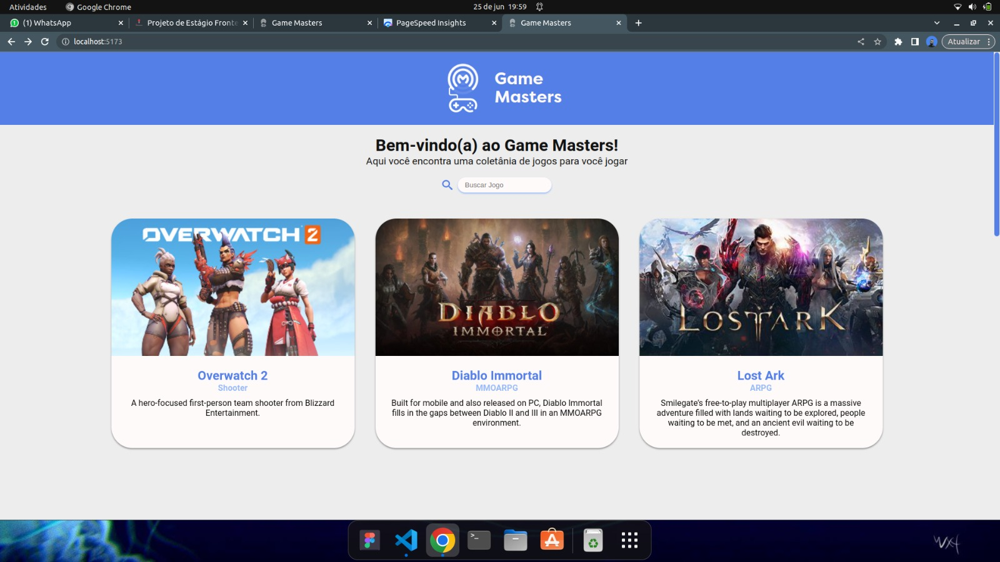
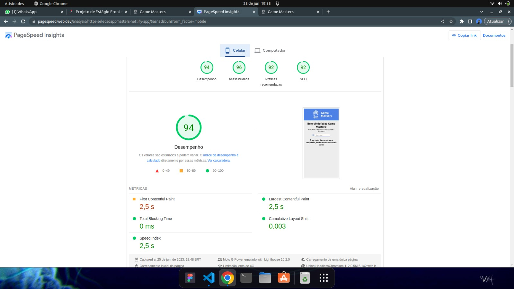
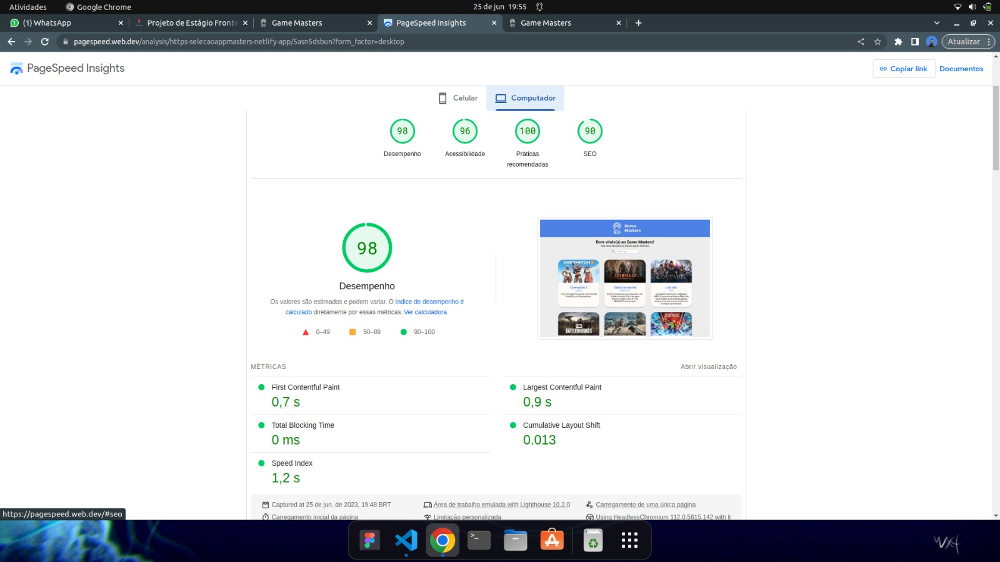

# Game Masters
Este projeto foi feito para o processo seletivo de estágio Front-End da AppMasters. <a href="https://selecaoappmasters.netlify.app/" target="_blank"> Visitar projeto </a>

Em minha análise, consegui cumprir 11 dos 12 itens pedidos. E acrescentei funcionalidades extras, como a navegação em páginas, exibindo de 12 em 12 jogos e assim facilitando o carregamento e melhorando a experiência de usuário.
Utilizei o PageSpeed (do Google) para analisar a performance da página e tive excelentes resultados: 98/100 no desktop e 94/100 no mobile.

Confira algumas imagens:

